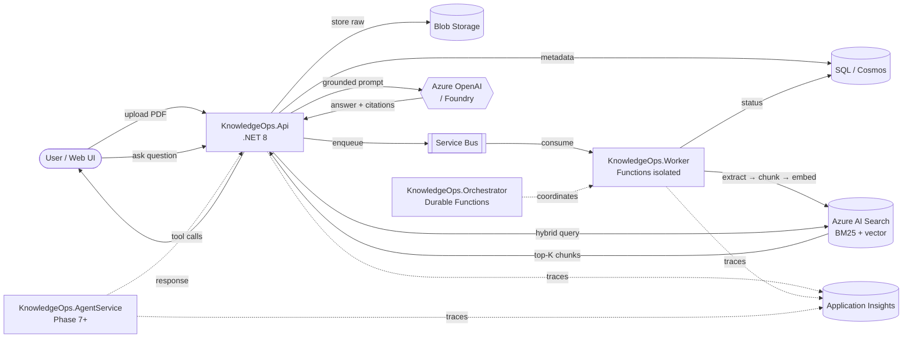

# enterprise-ai-knowledge-ops

> **Status: Phase 1 of 12 complete.** Active work in progress. Document upload endpoint is live with blob persistence, metadata tracking, correlation logging, and Swagger. See the [Roadmap](#roadmap), [Run it locally](#run-it-locally), and [Current Limitations](#current-limitations).

Enterprise AI knowledge operations platform using **Azure OpenAI**, **Azure AI Search**, **RAG**, **agentic workflows**, **tool-calling agents**, **Durable Functions**, and **enterprise observability** patterns.

---

## Why This Project Exists

Enterprise organizations struggle to operationalize AI across large document ecosystems while maintaining governance, retrieval quality, observability, and workflow integration. Most public RAG demos are toy chatbots — they don't survive contact with real corpora, real failure modes, or real auditors.

This platform demonstrates the patterns that *do* survive:

- **Grounded RAG** with mandatory citations and "not enough information" responses when retrieval is weak
- **Hybrid retrieval** combining BM25 keyword search and vector similarity, fused with Reciprocal Rank Fusion
- **Document intelligence** — structured field extraction with validation and human-review escalation
- **Tool-calling agents** with logged, bounded, and recoverable tool execution
- **Bounded multi-agent orchestration** — planner/executor patterns with step budgets and audit trails
- **Durable Functions** for long-running, checkpoint-recoverable workflows
- **Evaluation pipelines** so prompt and chunking changes can be compared with numbers, not opinions
- **Distributed observability** — every retrieval, model call, and tool invocation traceable end-to-end via correlation IDs
- **Enterprise security** — Entra ID, Managed Identity, Key Vault, RBAC, role-based document access

It is built phase-by-phase rather than vibe-coded as one big drop, so each capability has explicit "done" criteria and the design decisions behind it are documented.

---

## Architecture (target state)



More detail (per-phase data flow, query flow, message contracts) lives in [docs/architecture.md](docs/architecture.md) and [docs/data-flow.md](docs/data-flow.md).

---

## Stack

| Concern | Technology |
|---|---|
| Backend API | .NET 8 Web API |
| Async worker | Azure Functions (isolated worker) |
| Long-running orchestration | Azure Durable Functions |
| Search | Azure AI Search (hybrid BM25 + vector + RRF) |
| LLM | Azure OpenAI / Microsoft Foundry model deployment |
| Object storage | Azure Blob Storage |
| Metadata store | Azure SQL or Cosmos DB *(decision deferred — see [ADR-0003](docs/adr/0003-metadata-store-sql-vs-cosmos.md))* |
| Messaging | Azure Service Bus *(see [ADR-0004](docs/adr/0004-messaging-service-bus.md))* |
| Monitoring | Application Insights |
| Frontend | React or Blazor *(deferred to Phase 5+)* |
| Agents | Microsoft Foundry Agent Service *(deferred to Phase 7+ — see [ADR-0001](docs/adr/0001-build-in-strict-phase-order.md))* |

---

## Repository layout

```
/src
  /KnowledgeOps.Api            ← .NET 8 Web API (Phase 1)
  /KnowledgeOps.Worker         ← Azure Functions isolated worker (Phase 2)
  /KnowledgeOps.Orchestrator   ← Durable Functions (Phase 9)
  /KnowledgeOps.AgentService   ← Foundry Agent Service host (Phase 7+)
  /KnowledgeOps.Shared         ← Shared contracts, DTOs, message types
  /KnowledgeOps.Web            ← React or Blazor frontend (Phase 5+)
/tests                         ← Unit + integration + evaluation tests
/docs                          ← Architecture, data flow, chunking, eval, failure
/docs/adr                      ← Architecture Decision Records
/infra                         ← IaC (Bicep/Terraform — Phase 12)
```

---

## Roadmap

Built in strict order — no jumping ahead. Each phase has explicit "done when" criteria.

| # | Phase | Status | Done when |
|---|---|---|---|
| 0 | Repo scaffolding + design docs | ✅ Complete | Folder structure, 5 design docs, 4 ADRs |
| 1 | Upload PDF, store metadata | ✅ Complete | 5 PDFs uploaded to Azurite, SQLite row per file, correlation IDs logged, Swagger live, 5 tests pass |
| 2 | Async processing via Service Bus | ⏳ Next | API returns fast; worker independent; failures preserved |
| 3 | Extract text + chunk | ⬜ | Bad vs good chunk results documented; overlap rationale clear |
| 4 | Embeddings + Azure AI Search | ⬜ | Hybrid beats keyword-only and vector-only on eval set |
| 5 | RAG with citations | ⬜ | 20-question eval set passes; weak-retrieval returns "not enough info" |
| 6 | Structured extraction | ⬜ | 5 doc types processed; bad extractions flagged for review |
| 7 | Tool-calling agent | ⬜ | Agent can create a case end-to-end; every tool call logged |
| 8 | Multi-agent workflow (bounded) | ⬜ | 4 agents; loops prevented; step budget enforced |
| 9 | Durable orchestration | ⬜ | Workflow survives mid-step failure; retries observable |
| 10 | Evaluation pipeline | ⬜ | Chunking + prompt comparisons produce numerical deltas |
| 11 | Observability | ⬜ | One failed answer traceable upload→retrieval→model→tools |
| 12 | Enterprise security | ⬜ | Entra ID + RBAC + Key Vault + Managed Identity |

Honest detail on what's missing right now: [docs/limitations.md](docs/limitations.md).

---

## Current limitations

This is Phase 0. Right now the repo contains **design documents and folder scaffolding only** — no compiled code, no running services, no live demo URL. That is by design: the project rebuilds each capability from first principles rather than dropping a finished system. See [docs/limitations.md](docs/limitations.md) for the full honest list of gaps and TODOs.

Screenshots of running systems (Application Insights traces, AI Search index, evaluation results, agent traces) will be added to this README as each phase produces something real to capture. They are not faked or borrowed.

---

## Run it locally

**Requirements**
- .NET 8 SDK
- Azurite (`npm install -g azurite`) — local Azure Blob Storage emulator
- (No database install needed — Phase 1 uses SQLite via EF Core. Production will use Azure SQL; see [ADR-0003](docs/adr/0003-metadata-store-sql-vs-cosmos.md).)

**Start Azurite**

```powershell
mkdir -Force $env:TEMP\azurite | Out-Null
azurite --silent --location $env:TEMP\azurite
```

**Run the API**

```powershell
cd src\KnowledgeOps.Api
$env:ASPNETCORE_ENVIRONMENT = "Development"
$env:ASPNETCORE_URLS = "http://localhost:5099"
dotnet run --no-launch-profile
```

The API listens on http://localhost:5099. Swagger UI: http://localhost:5099/swagger.

**Upload a PDF**

```bash
curl -i -X POST http://localhost:5099/api/documents/upload \
  -H "X-Uploaded-By: noman@example.com" \
  -F "file=@./your-document.pdf;type=application/pdf"
```

Response:

```http
HTTP/1.1 200 OK
Content-Type: application/json; charset=utf-8
X-Correlation-ID: 27c14f3ba777407da8444fcb16aa1fdf

{"documentId":"9efa71b1-ee5f-4227-97b0-4dba915fe6ce"}
```

The endpoint also accepts an inbound `X-Correlation-ID` header and echoes it back; if absent, one is generated. The correlation ID is attached to the logger scope for every log line in the request.

**Validation responses**

| Case | Status |
|---|---|
| Empty or missing `file` field | `400 Bad Request` |
| Content-Type other than `application/pdf` | `415 Unsupported Media Type` |
| File larger than 25 MB | `413 Payload Too Large` |

**Verify side effects**

```powershell
# 1. Document row in SQLite
sqlite3 .\src\KnowledgeOps.Api\knowledgeops.db "SELECT Id, FileName, Status FROM Documents"

# 2. Blob in Azurite (use Azure Storage Explorer or:)
curl http://127.0.0.1:10000/devstoreaccount1/raw-documents?restype=container&comp=list
```

**Run the tests**

```powershell
dotnet test KnowledgeOps.sln
```

Five integration tests cover validation (400/415), success path (blob + metadata + 200), correlation ID echo, and `X-Uploaded-By` capture. Tests use EF InMemory + a stub `IBlobUploader` — no Azurite required for the test suite.

---

## Documentation

**Design docs**
- [docs/architecture.md](docs/architecture.md) — component map, phase ownership, open questions
- [docs/data-flow.md](docs/data-flow.md) — ingestion + query flows, status state machine, message contracts
- [docs/chunking-strategy.md](docs/chunking-strategy.md) — why chunking, why overlap, configurations to test
- [docs/evaluation-plan.md](docs/evaluation-plan.md) — test set format, metrics, pass criteria
- [docs/failure-handling.md](docs/failure-handling.md) — failure modes per phase, DLQ strategy, principles
- [docs/limitations.md](docs/limitations.md) — what's deliberately not built yet

**Architecture Decision Records**
- [ADR-0001 — Build in strict phase order; defer Foundry Agent Service](docs/adr/0001-build-in-strict-phase-order.md)
- [ADR-0002 — Hybrid search over vector-only retrieval](docs/adr/0002-hybrid-search-over-vector-only.md)
- [ADR-0003 — SQL vs Cosmos for metadata (open)](docs/adr/0003-metadata-store-sql-vs-cosmos.md)
- [ADR-0004 — Service Bus over Storage Queues / Event Grid](docs/adr/0004-messaging-service-bus.md)

---

## License

Not yet selected. Default GitHub terms apply until a `LICENSE` file is committed.
