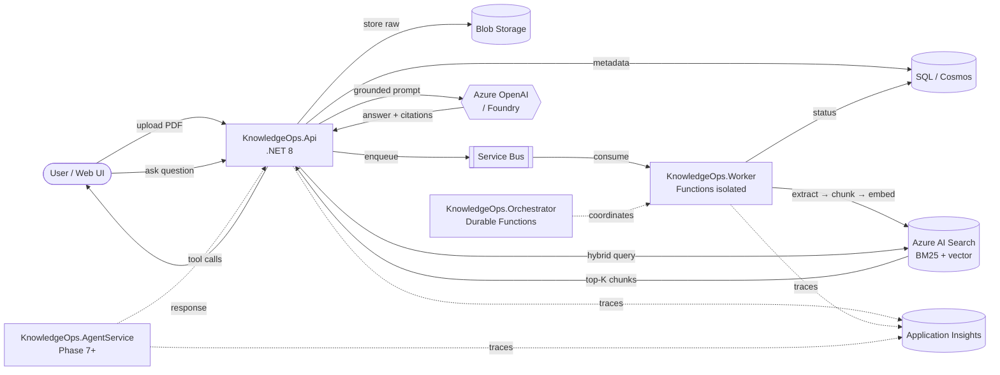
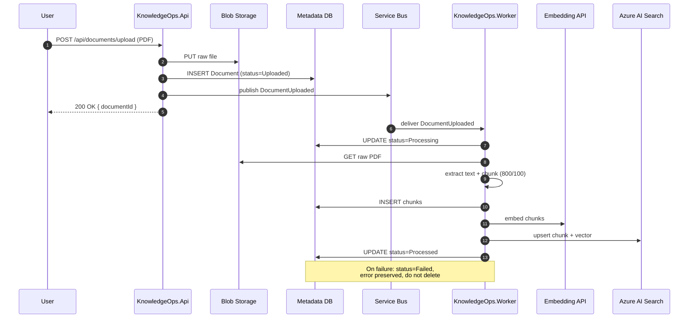
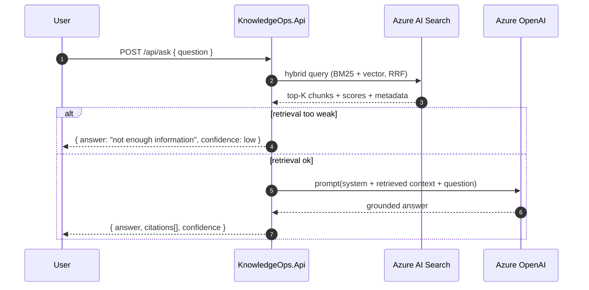
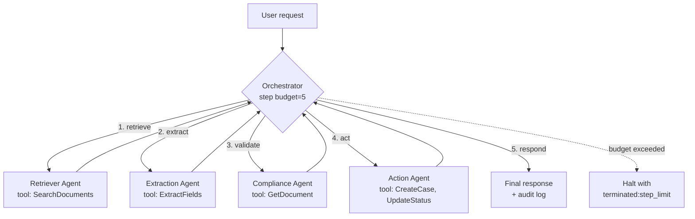

# Architecture

> Status: **Phase 0 draft.** Contents are aspirational. Each phase replaces the matching section with what was actually built.

## Goal

Build an enterprise document intelligence platform that ingests PDFs, extracts structured information, answers grounded questions with citations, and exposes agent-driven workflows — all on Azure-native services with full traceability.

## Target stack

| Concern | Service |
|---|---|
| Backend API | .NET 8 Web API (`KnowledgeOps.Api`) |
| Async worker | Azure Functions isolated worker (`KnowledgeOps.Worker`) |
| Long-running orchestration | Azure Durable Functions (`KnowledgeOps.Orchestrator`) |
| Agents | Microsoft Foundry Agent Service (`KnowledgeOps.AgentService`) |
| Search | Azure AI Search (hybrid: BM25 + vector + RRF) |
| LLM | Azure OpenAI / Foundry model deployment |
| Object storage | Azure Blob Storage |
| Metadata store | Azure SQL or Cosmos DB ([ADR-0003](adr/0003-metadata-store-sql-vs-cosmos.md) open) |
| Messaging | Azure Service Bus ([ADR-0004](adr/0004-messaging-service-bus.md)) |
| Monitoring | Application Insights |
| Frontend | React or Blazor (deferred to Phase 5+) |

## Component map (target — not yet built)

## Ingestion pipeline (Phase 1 → Phase 4)

## RAG query flow (Phase 5)

## Agent orchestration (Phase 7 → Phase 8)

## Phase ownership

| Phase | Component(s) introduced |
|---|---|
| 1 | Api + Blob + metadata store |
| 2 | Service Bus + Worker, async status flow |
| 3 | Chunking pipeline (still in Worker) |
| 4 | Azure AI Search index, embeddings, search endpoint |
| 5 | RAG `/api/ask` endpoint, citation contract |
| 6 | Structured extraction endpoint |
| 7 | Single tool-calling agent |
| 8 | Multi-agent orchestrator (bounded) |
| 9 | Durable Functions for long-running workflows |
| 10 | Evaluation harness |
| 11 | App Insights / distributed tracing |
| 12 | Entra ID, Key Vault, RBAC, Managed Identity |

## Open architecture questions

- **Metadata store:** SQL vs Cosmos. See [ADR-0003](adr/0003-metadata-store-sql-vs-cosmos.md) — decided in Phase 1.
- **Chunk persistence:** Chunks in SQL/Cosmos *and* Search, or Search-only with metadata pointers? Decided in Phase 3.
- **Frontend:** React vs Blazor. Deferred until there is an API worth driving.
- **Agent runtime:** Foundry Agent Service vs in-process tool loop. Per [ADR-0001](adr/0001-build-in-strict-phase-order.md), build mechanics by hand first; revisit Foundry in Phase 7.
